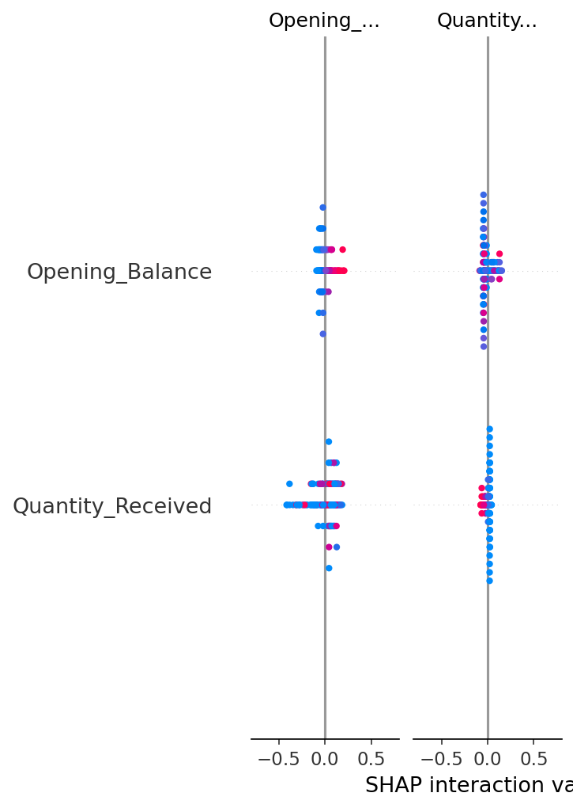

# Clinical Translation & Interpretability Briefing

## To: Head Pharmacist / Clinical Lead
## From: Titus A. A. Aduku, PI
## Subject: Analysis of Key Drivers in NCD Medication Stock-out Events

---

### 1.0 Objective

This briefing translates the statistical findings from our predictive model into actionable clinical and operational insights. A logistic regression model was trained to forecast stock-out risk, and this document uses SHAP (SHapley Additive exPlanations) analysis to explain **why** the model makes its predictions. This moves us beyond a "black box" and toward a trustworthy decision support tool.

### 2.0 Visual Analysis: Key Predictive Factors

The following SHAP summary plot ranks the factors that most influence the model's risk assessment.

*Figure 1: Feature impact on stock-out prediction. Factors at the top have the most influence. Red dots indicate a high value for that factor (e.g., high opening balance), blue dots a low value.*

---

### 3.0 Actionable Insights & Clinical Translation

The model has learned logical, verifiable patterns from the data. The three most important drivers are:

**1. INSIGHT: Low Opening Balance is the Strongest Warning Sign.**
*   **Technical Finding:** A low `Opening_Balance` (blue dots, right side) has the highest positive SHAP value, meaning it is the single strongest predictor of a stock-out.
*   **Clinical Translation:** This validates the model's core logic. It has correctly learned the most fundamental rule of inventory management. This builds confidence that the model is not relying on spurious correlations.

**2. INSIGHT: Inconsistent Shipments are a Major Risk Factor.**
*   **Technical Finding:** A low `Quantity_Received` (blue dots, right side) is the second most powerful predictor of a stock-out.
*   **Clinical Translation:** The model has identified that interruptions in the supply chain are a primary driver of risk. **This provides quantitative evidence to hospital administration** to advocate for more consistent or timely delivery schedules from the central medical store.

**3. INSIGHT: Demand Trends are Detectable.**
*   **Technical Finding:** Features like `consumption_lag_1` (last month's consumption) and `month` are significant predictors.
*   **Clinical Translation:** The model is successfully capturing trends in patient demand and potential seasonality. **This allows a pharmacist to anticipate**, for example, that demand for a certain drug tends to increase in a specific quarter, allowing for proactive ordering.

### 4.0 Conclusion for Clinical Practice

The NCD Stock-out Predictor is not a replacement for clinical judgment. It is a **cognitive aid**. The interpretability of the model allows a pharmacist to see a "High Risk" prediction and immediately understand *why* the alarm is being raised (e.g., "The model is flagging this because consumption has been high for two months and we haven't received a shipment."). This **explainable AI (XAI)** approach is critical for building the trust required for real-world adoption.