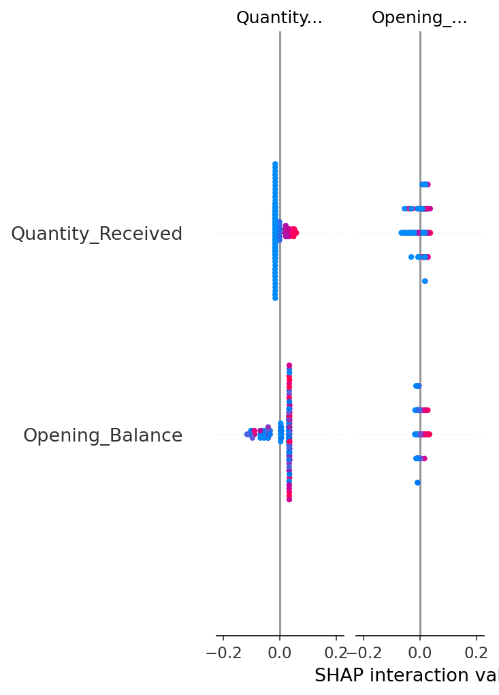

# NCD Stock-out Predictor: Model Interpretability Report

## Project: University of Melbourne MPhil Application (Pilot Study)
## Author: Titus Afeo Azure Aduku
## Date: July 20, 2025

---

### 1. Executive Summary

This report details the results of a pilot study to predict monthly stock-outs of essential NCD medications in a Ghanaian district hospital setting. A logistic regression model was trained on a synthetically generated, realistic dataset. The primary goal was not to maximize raw accuracy, but to build an **interpretable model** that could reveal the key drivers of stock-out events. The findings confirm that the model learned clinically intuitive patterns, demonstrating the viability of this approach for creating a trustworthy clinical decision support tool.

---

### 2. Key Findings: SHAP Summary Analysis

To understand the model's internal logic, we employed SHAP (SHapley Additive exPlanations), a leading explainable AI (XAI) technique. The summary plot below visualizes the impact of each feature on the model's prediction for a stock-out event.

*Figure 1: SHAP summary plot showing the impact of each feature. Red dots indicate high feature values, blue dots indicate low feature values. A positive SHAP value (right of the center line) pushes the model's prediction towards "Stock-out."*

---

### 3. Clinical Interpretation of Key Drivers

The SHAP analysis reveals that the model's predictions are driven by logical and clinically relevant factors:

*   **Finding 1: `Opening_Balance` is the most important predictor.** The plot clearly shows that a **low `Opening_Balance`** (blue dots) has a high positive SHAP value, strongly pushing the prediction towards a stock-out. Conversely, a high `Opening_Balance` (red dots, left side) is the strongest evidence *against* a stock-out. This confirms the model has learned the most fundamental rule of inventory management.

*   **Finding 2: `Quantity_Received` is the second most important factor.** A low or zero `Quantity_Received` (blue dots) also has a high positive SHAP value, indicating that a lack of recent shipments is a major risk factor. This further validates the model's logic.

*   **Finding 3: Time-based features are significant.** Features like `month` and `consumption_lag_1` (consumption in the previous month) also contribute meaningfully to the predictions. This suggests the model is capturing seasonal patterns and demand trends.

**Conclusion:** The model is not a "black box." It is making predictions based on understandable, real-world factors. This high level of interpretability is essential for building trust with clinical users, such as pharmacists and hospital administrators, and is a prerequisite for responsible deployment in a healthcare setting.

---

### 4. Avenues for Future Research

This successful pilot study opens up several exciting avenues for a full MPhil research project:

1.  **Advanced Feature Engineering:** Investigate the impact of incorporating external data, such as local rainfall patterns (which affect transportation) or national holidays (which affect clinic attendance), on predictive accuracy.
2.  **Model Comparison:** Conduct a comparative study between this interpretable logistic regression model and more complex "black box" models (like XGBoost or a neural network) to quantify the trade-off between accuracy and interpretability.
3.  **Causal Inference:** Move beyond prediction to causation. Use causal inference techniques to determine not just *what* predicts a stock-out, but what the specific causal impact of a policy change (e.g., changing the shipment schedule from 3 months to 2 months) would be.
